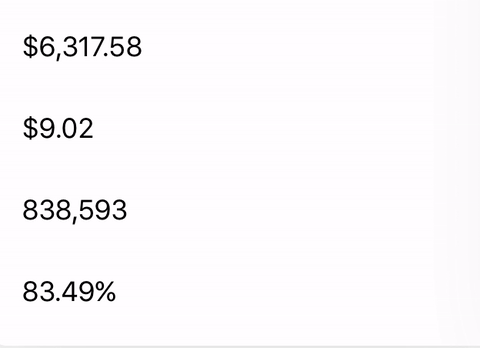

# AnimatingLabel

Adds animation feature for numeric values in UILabel. 



## Usage

```swift
let label: UILabel

label.animate(to: 5.0)
label.animate(to: 5.0, duration: 1.0)
label.animate(to: 5.0, duration: 1.0, formatter: NumberFormatter(), easingOption: .easeInOut)
```

## Installation

**Carthage**

<code>github "codewise/AnimatingLabel"</code>

